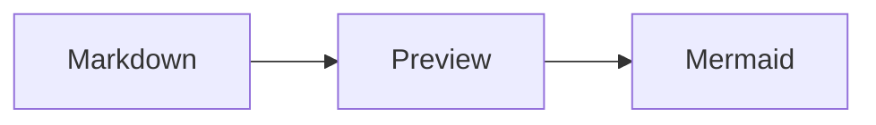

# markdown-preview

Upload and display Markdown files with embedded [Mermaid](https://mermaid.js.org/) diagrams.

- **Frontend**: React, TypeScript, Vite — [`react-markdown`](https://github.com/remarkjs/react-markdown) with [GFM](https://github.com/remarkjs/remark-gfm), [`mermaid`](https://github.com/mermaid-js/mermaid), [`github-markdown-css`](https://github.com/sindresorhus/github-markdown-css).
- **Backend**: FastAPI — `GET /health`, `POST /api/preview/upload` (multipart field `file`, `.md` / `.markdown`, max 5 MB, UTF-8).

## Prerequisites

- Python 3.10+ with `venv`
- Node.js 24 (e.g. `nvm use 24`)

## Run locally

### 1. Backend

```bash
cd backend
python3 -m venv ../.venv
source ../.venv/bin/activate   # Windows: ..\.venv\Scripts\activate
pip install -r requirements.txt
uvicorn app.main:app --reload --port 8000
```

Optional: set `FRONTEND_ORIGIN` if the UI is not on `http://localhost:5173` (CORS adds this origin automatically).

### 2. Frontend

```bash
cd frontend
npm install
npm run dev
```

Open the printed URL (usually `http://localhost:5173`). The dev server proxies `/api` and `/health` to `http://127.0.0.1:8000`.

Use **Choose .md file** to upload a Markdown file. If the API is down, the app still previews the file locally and shows a short notice.

## Run with Podman (containers)

From the repository root, build and start the backend and frontend:

```bash
podman-compose up --build
```

Equivalent: `./scripts/podman-up.sh` from the repo root.

Then open **http://localhost:5173**. The API is on **http://localhost:8000** (for example `GET /health`).

Stop and remove containers:

```bash
podman-compose down
```

**Notes**

- On many Linux setups the `docker` command is a Podman shim that does **not** implement `docker compose`. Use **`podman-compose`** (install the `podman-compose` package if needed) or install the [Podman Compose](https://github.com/containers/podman-compose) plugin so `podman compose` works.
- `docker-compose.yml` pins images as `localhost/markdown-preview-*` so Podman does not treat short names like `markdown-preview_backend` as pulls from other registries when a local build is required.
- Container builds use **pinned Python dependencies** and **retries** for `pip` and `npm ci`. Base images already ship CA certificates; we avoid extra `apt-get` steps so flaky Debian mirror downloads do not fail the build.
- `docker-compose.yml` sets **`build.network: host`** so `pip` / `npm` use the same networking as your machine during image build. That avoids many TLS errors on WSL2 and flaky container bridges (`bad record MAC`, `ERR_SSL_CIPHER_OPERATION_FAILED`). Docker Desktop on Mac typically falls back to a normal bridge for unsupported host networking.
- If installs still fail, retry when the network is stable; check VPN, proxy, and corporate TLS inspection. As a last resort, run `podman system prune` and rebuild to clear corrupted layer cache.

## Tests

### Backend (pytest)

From the repository root (with the virtualenv activated):

```bash
pip install -r backend/requirements-dev.txt
cd backend
pytest
```

### Frontend (Vitest)

```bash
cd frontend
npm test
```

Use `npm run test:watch` for watch mode.

## API

| Method | Path | Description |
| ------ | ---- | ----------- |
| `GET` | `/health` | Liveness JSON: `{ "status": "ok" }` |
| `POST` | `/api/preview/upload` | Form field `file`: `.md` / `.markdown`, UTF-8, max 5 MB. Response: `{ "content": "..." }` |

## Sample Markdown with Mermaid

Save as `example.md` and open it in the app:

````markdown
# Diagram example


````

GFM tables and task lists are supported via `remark-gfm`.

## Production build (frontend)

```bash
cd frontend
npm run build
```

Serve the `frontend/dist` static files with any static host; configure that host to proxy `/api` and `/health` to your FastAPI process, or run the API behind the same origin.
